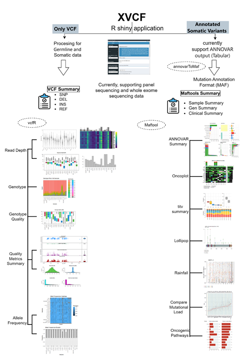

---
output:
  pdf_document: default
  html_document: default
---
# XVCF
<a href="https://github.com/rashidma/XVCF">XVCF</a> © 2025 by Ghaida Almuneef and Mamoon Rashid is licensed under <a href="https://creativecommons.org/licenses/by-nc-nd/4.0/">Creative Commons Attribution-NonCommercial-NoDerivatives 4.0 International</a>

XVCF (eXplore VCF) is a tool for visualization and quality control of genetic variation data.

## Dependencies
XVCF is developed using R version 4.2.1 and requires following R packages:

1. shiny
2. vcfR
3. reshape2
4. ggplot2
5. shinydashboard
6. maftools
7. tidyr
8. readxl
9. DT
10. shinyjs

Please take extra precautions while installing "maftools" Bioconductor package. It requires another Bioconductor package "Rhtslib" which in turn require "libcurl4-openssl-dev" in linux machines.

Tips: 
1.  You keep versions of R and BiocManager up to date.
2. When you update R please update your packages.
3.  Install system-wide packages required by "Rhtslib" specially in Linux environment.

## Motive
The premise behind developing "XVCF" shiny package is to pat the gap between
heap of genomic data available and their corresponding
visualization software/tool. 

## Solution
We addressed this need timely and provided easy to use,light-weight, GUI-based tool specifically for those who are less versed in
programming or computer skills.

## Methods
We used "vcfR" and "maftools" R packages as back bones of "XVCF".

"XVCF" has two blocks operational. In the first block XVCF accepts a vcf file and generate some quality statistics like Read depth, Genotype, Genotype quality, Allele metrics etc. In the second module, it accepts ANNOVAR annoated vcf data in tabular format. The second module is basically for Cancer Genomic data and handled by underlying "maftools" R package. Below is the schematic diagram of XVCF depicting both the modules.

 

